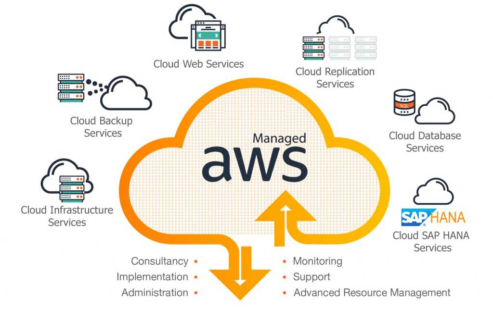

# Cloud Documentation



## About the cloud instance

Brief description of the *OOP* used in the project.

### What are S3 Buckets ?

---

## See also, AWS-CLI

Brief description of how threading impacts the execution of python scripts.

### Configuration commands

How to call threaded executions in Python
```bash
aws 
```

```bash
aws 
```

```bash
aws 
```
---

### Useful Links

[Go back ..](../README.md)
